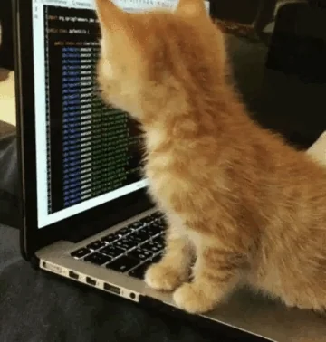

	
	 
	 

**i love code**&nbsp;&nbsp;&nbsp;&nbsp;**and unicorns**&nbsp;&nbsp;

 

 

check out my latest project: [bobby404-k](https://github.com/bobby404-k) 

and connect with me on [LinkedIn](https://www.linkedin.com/in/bobby-kushwah-94a198398/) 

 
 

      

